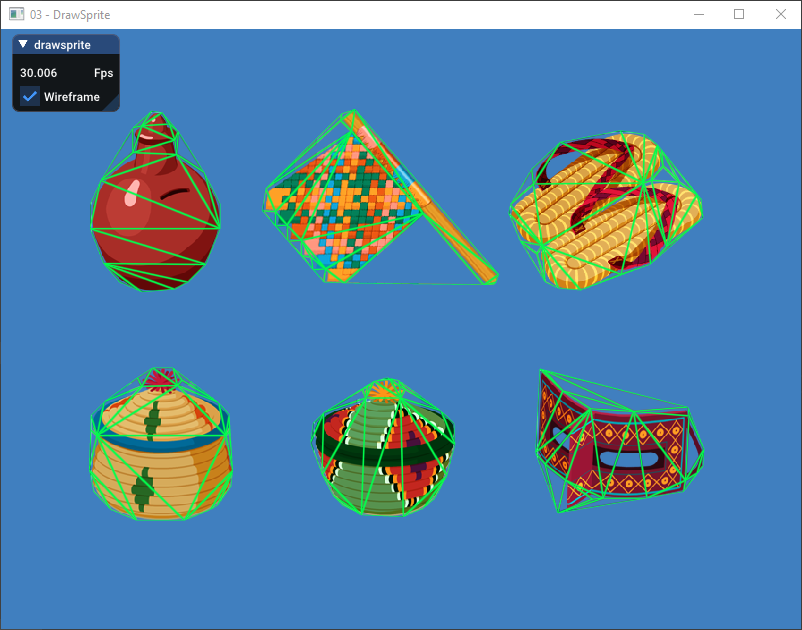

[](https://travis-ci.org/septag/atlasc)

## Atlasc
[@septag](https://twitter.com/septagh)  

_atlasc_ is a command-line program that builds atlas texture from a bunch of input images.  

## Main Features
- Cross-platform. Runs on linux/macOS/windows.
- No dependencies
- Outputs atlas description to human-readable _json_ format. Generated images are _png_.
- Alpha trimming.
- Mesh sprites.
- Scaling
- Can build as static library

  
<sub><sup>screenshot taken from [rizz](https://github.com/septag/rizz) sprite example</sup></sub>

## Build
It has built and tested on the following platforms:

- __Windows__: Tested on Windows10 with visual studio 14 2015 update 3 (Win64).  
- __Linux__: Tested on ubuntu 16 with clang (6.0.0) and gcc (7.3.0). Package requirements:  
- __MacOS__: Tested on MacOS High Sierra - AppleClang 9.1.0

## Usage

```
atlasc image1.png image2.png -o output.json [extra args]
```

**Arguments**:

```
-h --help                           - Print help text
-V --version                        - Print version
-i --input=<Filepath>               - Input image file(s)
-o --output=<Filepath>              - Output file
-W --max-width(=Pixels)             - Maximum output image width (default:1024)
-H --max-height(=Pixels)            - Maximum output image height (default:1024)
-B --border(=Pixels)                - Border size for each sprite (default:2)
-2 --pot                            - Make output image size power-of-two
-P --padding(=Pixels)               - Set padding for each sprite (default:1)
-m --mesh                           - Make sprite meshes
-M --max-verts(=Number)             - Set maximum vertices for each generated sprite mesh (default:25)
-A --alpha-threshold(=Number)       - Alpha threshold for cropping (0..255)
-s --scale(=Number)                 - Set scale for individual images (default:1.0)
```

## Static Library
To build _atlasc_ as static library instead of command-line tool, set `STATC_LIB` in cmake options.

```
cmake . -DSTATIC_LIB=1
```

There are three methods for creating atlases using the library:

- Load from image files and output to image file: `atlasc_make`
- Load from image files and return atlas in memory: `atlasc_make_inmem`
- Load from images loaded in memory and return atlas in memory: `atlasc_make_inmem_fromem`
  
For more information, read the header file [atlasc.h](include/atlasc.h)

## TODO
- Support for islands. currently, there is a limitation that individual images should not have islands of pixels
- Optimizations. It's a very early implementation and probably some parts of it has to be optimized 

## Open-Source libraries used
- [sx](https://github.com/septag/sx): Portable base library
- [sjson](https://github.com/septag/sjson): Fast and portable single-header C file Json encoder/decoder
- [stb](https://github.com/nothings/stb): stb single-file public domain libraries for C/C++
- [sproutline](https://github.com/ands/sproutline): A small single-file library for sprite outline extraction and simplification
- [delanuay](https://github.com/eloraiby/delaunay): Relatively Robust Divide and Conquer 2D Delaunay Construction Algorithm


[License (BSD 2-clause)](https://github.com/septag/atlasc/blob/master/LICENSE)
--------------------------------------------------------------------------

<a href="http://opensource.org/licenses/BSD-2-Clause" target="_blank">

</a>

	Copyright 2019 Sepehr Taghdisian. All rights reserved.
	
	https://github.com/septag/atlasc
	
	Redistribution and use in source and binary forms, with or without
	modification, are permitted provided that the following conditions are met:
	
	   1. Redistributions of source code must retain the above copyright notice,
	      this list of conditions and the following disclaimer.
	
	   2. Redistributions in binary form must reproduce the above copyright notice,
	      this list of conditions and the following disclaimer in the documentation
	      and/or other materials provided with the distribution.
	
	THIS SOFTWARE IS PROVIDED BY COPYRIGHT HOLDER ``AS IS'' AND ANY EXPRESS OR
	IMPLIED WARRANTIES, INCLUDING, BUT NOT LIMITED TO, THE IMPLIED WARRANTIES OF
	MERCHANTABILITY AND FITNESS FOR A PARTICULAR PURPOSE ARE DISCLAIMED. IN NO
	EVENT SHALL COPYRIGHT HOLDER OR CONTRIBUTORS BE LIABLE FOR ANY DIRECT,
	INDIRECT, INCIDENTAL, SPECIAL, EXEMPLARY, OR CONSEQUENTIAL DAMAGES (INCLUDING,
	BUT NOT LIMITED TO, PROCUREMENT OF SUBSTITUTE GOODS OR SERVICES; LOSS OF USE,
	DATA, OR PROFITS; OR BUSINESS INTERRUPTION) HOWEVER CAUSED AND ON ANY THEORY OF
	LIABILITY, WHETHER IN CONTRACT, STRICT LIABILITY, OR TORT (INCLUDING NEGLIGENCE
	OR OTHERWISE) ARISING IN ANY WAY OUT OF THE USE OF THIS SOFTWARE, EVEN IF
	ADVISED OF THE POSSIBILITY OF SUCH DAMAGE.
